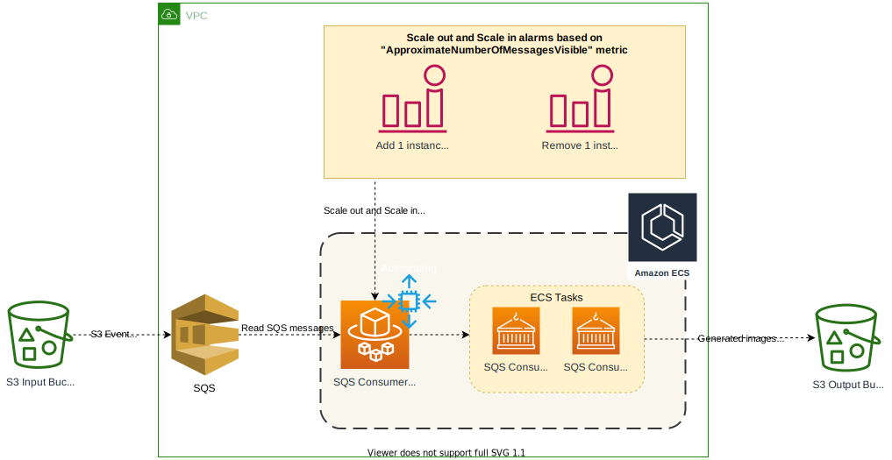
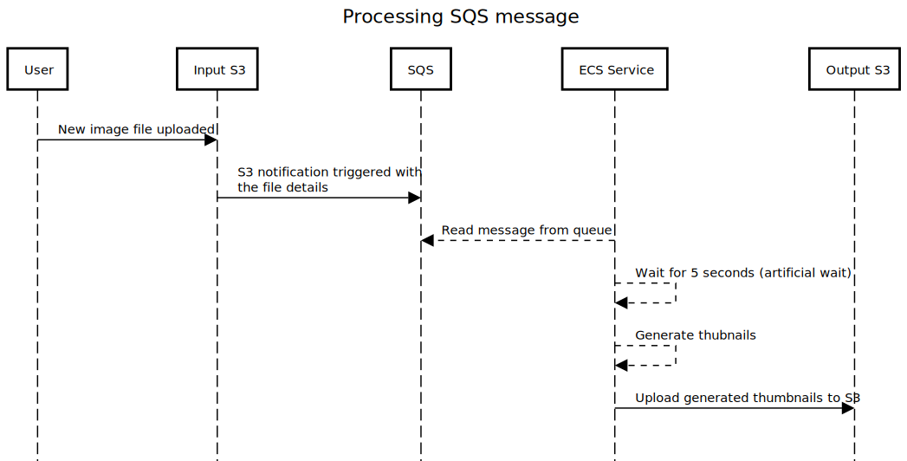
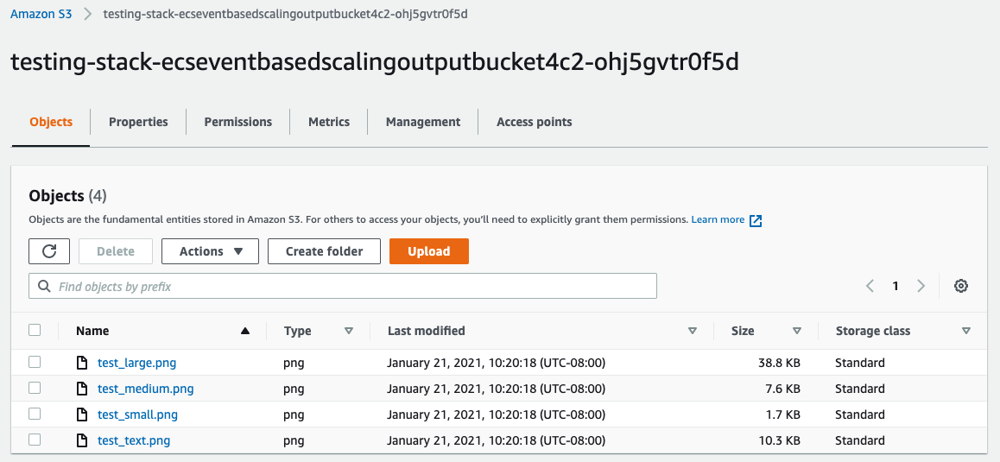

# Scaling event based system using containers

This article talks about an approach to scale SQS consumers that are deployed in container-based ecosystem using ECS

# Introduction

In most cases, AWS Lambda can effectively process all the messages in SQS, but you may need to consider using an EC2 instance or ECS service if you run into any of the following issues:

* Need more than 3 GB while processing an SQS message
* Processing, a batch of SQS messages, may take more than 15 mins
* Number of messages received per second is more than 1000 messages, and you would like to process as quickly as possible

In this case, we use the EC2 autoscaling group to process SQS messages in scale.

# Architecture

It is essential to understand the following factors before defining cloudwatch alarms and scaling policies as it may vary ultimately for each application depending upon the use case:

* Average time taken to process a message
* Acceptable latency for processing a message

Based on which we will set up autoscaling policies. Here is how the overall architecture looks like:



**Notes**

* When a user or an automated system uploads a new file to S3 "Input bucket," an event notification is triggered that automatically sends a message to the SQS queue
* The SQS consumer is deployed as an ECS service created using a spring boot application. Here are details around the application:
 * This application uses `Thread.sleep(5000)` to sleep for 5 seconds before processing each message. This wait time is added to create a backlog of messages that can demonstrate scaling in the system.
 * The application reads the S3 file location from the SQS message, created different thumbnails of the image inside the `/tmp` directory of the container, then uploads them to the S3 output directory.
* ECS service uses a combination of cloud watch alarms with a step scaling policy to scale in and out based on the total number of unprocessed messages in the queue using `ApproximateNumberOfMessagesVisible` metrics
* Scaling policies are defined as:
 * Add 1 instance if `ApproximateNumberOfMessagesVisible >= 40`
 * Add 3 instances if `ApproximateNumberOfMessagesVisible >= 100`
 * Remove 1 instance if `ApproximateNumberOfMessagesVisible <= 10`

Here is the sequence of events that happens when a user or an automated system uploads an image file to the Input S3 bucket



The code available in this repository is exposed as a CDK Construct. To learn more about CDK Construct, click [here](https://docs.aws.amazon.com/cdk/latest/guide/constructs.html)

# Build & Deployment

## Pre-requistes

* AWS CDK should be installed in the local laptop. You can read more about it [here](https://docs.aws.amazon.com/cdk/latest/guide/getting_started.html)
* ```Yarn``` needs to be installed, you can check the installation status by running this command
* An AWS account with console and API access

```bash
yarn version
```

**Output**

1.22.10

If ```Yarn``` is not installed run the following command

```bash
npm install -g yarn
```

## Build

Check out the code from this repository using this command:

```bash
mkdir ecs-event-based-scaling && cd ecs-event-based-scaling
git clone https://gitlab.aws.dev/am3-app-modernization-gsp/ecs-event-based-scaling.git .
```

Build the SQS consumer spring code using the following command:

```bash
cd src
mvn clean install
cd ..
```

## Deploy

As the code is created as a CDK construct, the following parameters can be customized as part of the deployment

| Parameter  | Description | Default |
| ------------- | ------------- | ----|
| vpc  |  VPC in which the resources needs to be created | New VPC will be created |
| inputBucket | S3 Input bucket, where the images for which thumbnails need to be generated will be uploaded | New S3 bucket |
| outputBucket | S3 Output bucket, where the generated thumbnails will be uploaded | New S3 Bucket |
| scalingCoolDown | Cool down period parameter for autoscaling | 200 seconds |
| minInstances | Minimum number of instances for autoscaling | 1 |
| maxInstances | Maximum number of instances for autoscaling | 10 |

> Note: CDK Deploy will create a queue with a name `S3NotificationQueue` and spring boot consumer is configured to read messages from this queue. So any changes to queue name has to be made both on CDK script and spring boot application

Code for the sample application using this construct is available in `src/integ.default.ts`. In order to deploy the application, first bootstrap a CDK environment (if you haven't done so already).

```bash
# Bootstrap CDK (ONLY ONCE, if you have already done this you can skip this part)
# Subsitute your AWS Account Id and AWS region in the command below
$ cdk bootstrap \
    --cloudformation-execution-policies arn:aws:iam::aws:policy/AdministratorAccess \
    aws://<AWS Account Id>/<AWS_REGION>
```

Run the following command to start the deployment

```bash
cdk deploy --require-approval never
```

> Note: The above command will take care of building the docker image, pushing it to ECR and running a CDK deployment

Once the deployment is successful you will see the following output:

```bash
 ✅  testing-stack

Outputs:
testing-stack.EcsEventBasedScalinginputbucketoutput9F0DD2C3 = testing-stack-ecseventbasedscalinginputbucketa1d3-jx4tz0hfyh27
testing-stack.EcsEventBasedScalingoutputbucketoutput60F748A5 = testing-stack-ecseventbasedscalingoutputbucket4c2-ohj5gvtr0f5d
testing-stack.EcsEventBasedScalingqueueoutput84B7B8B9 = S3NotificationQueue
```

> Note: CDK output will specify input & output S3 bucket along with the SQS queue name

# Unit testing

Unit testcases can be executed by running the following command from the root directory

```bash
yarn test
```


```bash
yarn run v1.22.10
$ npx projen test
🤖 test | rm -fr lib/
🤖 test » test:compile | tsc --noEmit --project tsconfig.jest.json
🤖 test | jest --passWithNoTests --all --updateSnapshot
 PASS  test/index.test.ts
  ✓ create app (1137 ms)

  console.log
    /Users/harrajag/CodeBase/Pattern/ecs-event-based-scaling/src/sqs-consumer-spring

      at new EcsEventBasedScaling (src/index.ts:96:13)

----------|---------|----------|---------|---------|-------------------
File      | % Stmts | % Branch | % Funcs | % Lines | Uncovered Line #s
----------|---------|----------|---------|---------|-------------------
All files |     100 |       72 |     100 |     100 |
 index.ts |     100 |       72 |     100 |     100 | 42-51
----------|---------|----------|---------|---------|-------------------
Test Suites: 1 passed, 1 total
Tests:       1 passed, 1 total
Snapshots:   0 total
Time:        5.397 s
Ran all test suites.
🤖 test » eslint | eslint --ext .ts,.tsx --fix --no-error-on-unmatched-pattern src test build-tools .projenrc.js
✨  Done in 15.86s.
```

# Integration testing

## Simple test

A sample image can be found under `sample-image` folder. You can run the following command from the root directory to upload the image to the s3 input folder:

```bash
aws s3 cp test.png s3://<<input_bucket>>
```

The S3 upload will automatically trigger an SQS message, consumed by the spring boot application deployed as ECS service, and corresponding thumbnails get generated in the S3 output bucket. Here is a screenshot of it:



## Load test

You can simulate a load test scenario that will in turn trigger scaling by following the below steps:

Create a new folder and copy closer to 50 images into this folder

```bash
mkdir load-test && cd load-test

# Copy 50 images into this folder
cp <<50 image files>> .
```

Run the following command to sync the contents of the local folder to s3 input bucket

```bash
aws s3 sync load-test s3://<<input_bucket>>
```

It will create 50 SQS messages. Since the spring boot consumer waits 5 seconds before processing each message, a automatic cloudwatch scale out alarm will be triggered. As the result of this, an autoscaling event will occur, and a new ECS task instance will be added to the ECS service

# Cleanup

Run the following command from root directory to delete the stack

```bash
cdk destroy
```

# Resources

* [Scaling based on Amazon SQS](https://docs.aws.amazon.com/autoscaling/ec2/userguide/as-using-sqs-queue.html)
* [SQS Based ECS Service Autoscaling](https://medium.com/@gundogdu.emre/sqs-based-ecs-service-autoscaling-88772f4e260c)
